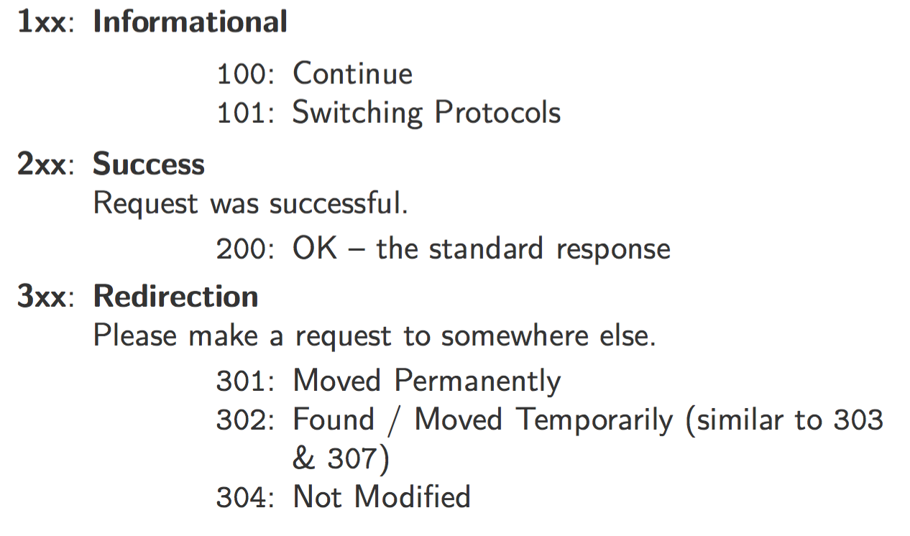
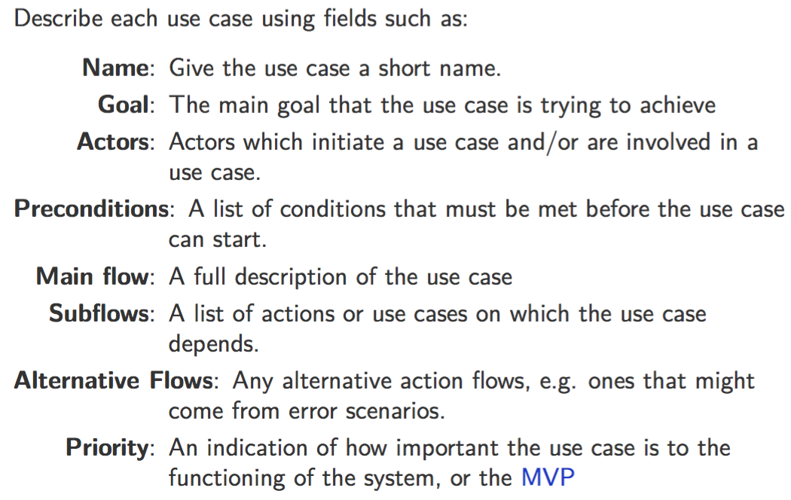
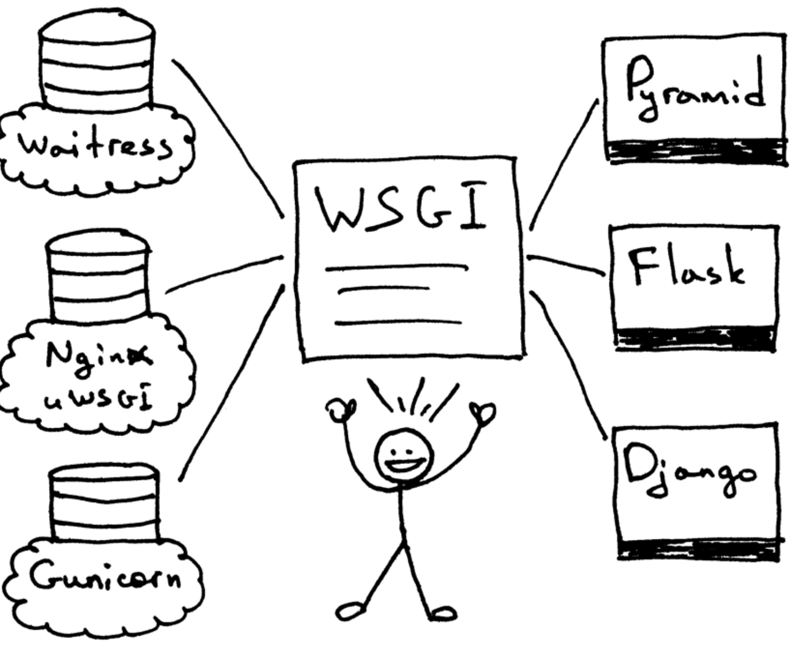
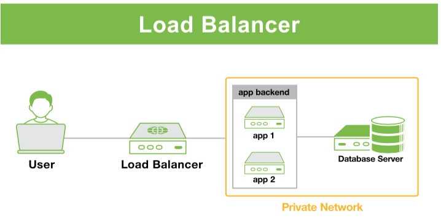
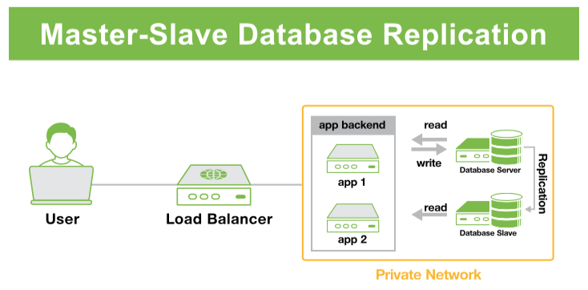

# **Web Fundamentals**:

## What happens when you enter a url into the browser?

 

## Concepts

**URL**: Uniform Resource Locator <= protocol://domain.tld/path/file.ext

**IP**: Internet Protocol;

**LB**: Load Balancer;

**DNS**: Domain Name Server;

**UDP**: User Datagram Protocol - port 53;

**TCP**: Transmission Control Protocol. It is used by other protocols such as FTP, HTTP and SMTP (sort of like trucks [TCP] carrying some loads[XXP] on a highway[IP])

**App Servers**: handles *processing* of HTTP requests **[** Backend website code + Business Logic + Database interface methods + Caching Layers.**]**. Different from Web Server which normally runs web softwares such as Nginx and  handles just the *reception* of HTTP requests

* Backend programming language + framework lies here
* Business Logic is defined and maintained here (if not SPA web architecture)
* Database Interface Methods
* Caching Layers

**Web Browser**:

* **DOM**: Document Object Model
* **HTML**: Hyper Text Markup Language
* **CSS**: Cascading Style Sheets
* **Browser Rendering**: done by web browser engines, e.g, WebKit of Safari

---

**OSI Model**: Operating System Interconnection Model;

- Physical: bits (0 / 1)
- Data link: bits => frames, Ethernet & LAN (Local Area Network)
- Network: IP & WAN (Wide Area Network)
- Transport: TCP & UDP
- Session: DNS
- Presentation: 
- Application: HTTP & FTP

----

##### **HTTP**(S): Hyper Transport (or Transfer) Protocol (Secure);

- Port: HTTP=80, HTTPS=443
- Request Components:

* Status Code:

----

##### **Web Server Software**

One of the most common stack: LAMP

* Linux + Apache + MySQL + PHP

# **Project Management**

**Process**:  Identify Problem <problem statement> 👉 Determine Use Cases <Action & Actors> 👉 Wireframes<UI & UX design> 👉  Software Requirement Specification<SRS> 

**What's in a Use Case Documentation**:

**Sequence Diagram**: 

* Useful for communicating how serveral systems interact <= focus on entities and orders of interactions. 
* Shows how objects operate with another by time sequence. 

**State & Flow Diagram**:

* Useful for communicating how abstract concepts progress through the system. <= focus on state transitions; explains a state machine

**SRS**: 

* Specifies the scope of the project <= checks when project is finished & prevents scope creep. 
* <u>Components</u>:
  * **Introduction**: business recognition; overall assessment of the project necessity
  * **Overall Description**: System structure (brief) + Dependencies + Constraints
  * **Specific Requirements**: Functional & Non-Functional requirements + other highly granular requirements. 

# **Web Servers and Application Architecture**

> [What is the difference between application server and web server????](http://stackoverflow.com/questions/936197/what-is-the-difference-between-application-server-and-web-server)

##### **Common Stacks**

| LAMP       | LEMP      | mean       |
| ---------- | --------- | :--------- |
| Linux      | Linux     | MongoDB    |
| **Apache** | **Nginx** | Express.Js |
| MySQL      | MySQL     | Angular.Js |
| PHP        | PHP       | Node.Js    |

**ASP**: Active Server Pages

**<u>WSGI</u>**: [Web Server Gateway Interface](https://ruslanspivak.com/lsbaws-part2/).

* It was created as a ***<u>low-level interface between web servers and web applications</u>*** or frameworks to promote common ground for portable web application development..
* If an application (or framework or toolkit) is written to the WSGI spec then it will run on any server written to that spec 

**Relational Database**: enforcing and maintaining relationships, MySQL (most commonly used) + PostgreSQL(complete support for reliable transaction [ACID] )  + SQLite

**Non-relational Database** (NoSQL): storing data like pages,  MongoDB (document based), Redis (K-V based), Cassandara (Column based) …. 

* Redis is useful for rapidly changing data with a foreseeable database size 
* MongoDB is good for dynamic queries / defining indexes. 
* ElasticSearch is good for having advanced/fuzzy search

|              |          |
| ---------------------------------------- | ---------------------------------------- |
| 👆 Web/App/Database Server all in ONE; The simplest form | 👆 Increase security; No resource contention  with App Server; But more complex and less independent on network connection |
|              | 👈  Useful for horizontal scaling; Imposing a single point of failure; LB can become the performance bottleneck; |
|           | 👈 Response are cached for a period of time in HAS, which can increase web performance (if caching is tuned properly :0 ); Imposing a single point of failure |
|         | 👈 Brings great performance Improvement on database system that performs <u>many reads compared to writes</u> (i,em improve database parallelizability of READ); Additional attention to asynchronous issues (e.g, slave drift) |