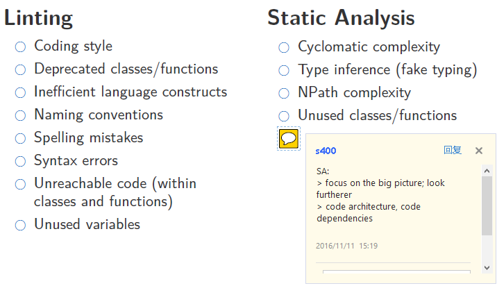
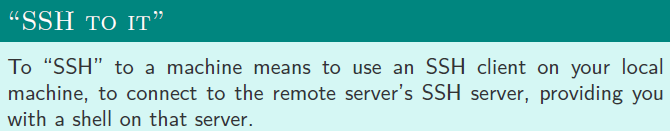
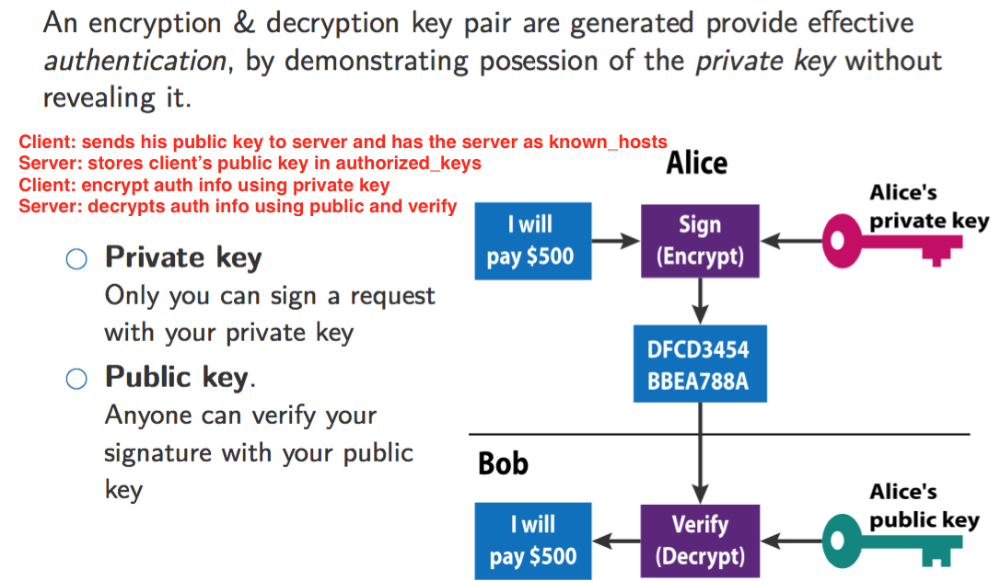
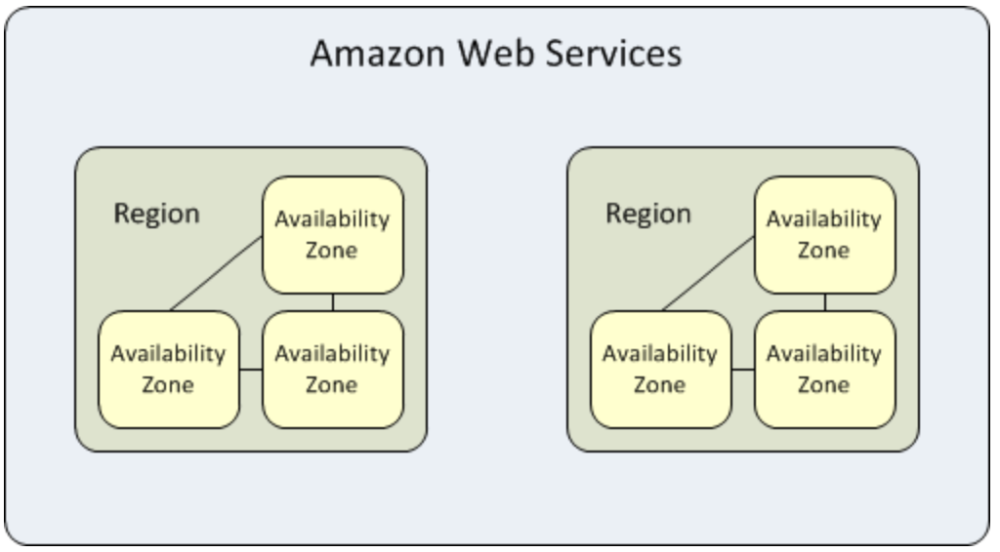

# Continuous Integration And Deployment

## **Motivation**

* Having developers each working on individual module and wait for the final completion to start integration results in **INTEGRATION HELL**, a state where *<u>developers spend more time solving conflicts than writing the code itself</u>*

* To avoid suffering in the hell, we need **CI**, which is the practice of merging all developer working copies to a shared mainline *<u>several times a day</u>*. 

  > Fail fast, fail often

## **Conflicts**

##### **Types of Conflicts**

* **Merge conflict** == Developers have modified the same file concurrently
* **Logical conflict** == … such that the resulting system does not compile, i.e, 'You broke my code!!'
* **Functional conflict** == … such that the system does not execute successfully, i.e, 'Your code does not work with my code!!'

##### **Mitigations**

* Components should be independent as much as possible
* Use shared modules

## **Incremental Changes**

##### **Benefits**

1. ***Avoid 'stale branches'*** <= less chance of massive code rebasing
2. ***Small bugs are checked early***, and it's cheaper to rollback to a latest bug free state where only a small set of changes are lost.
3. Invisibly pushes developers to create ***modular, functional, quality and less complex code***

##### <u>How to be CI?</u>

* *Linting and Static Analysis*
* *Building*
* *Testing*
* *Publishing, Releasing and Deploying*

## **Anatomy of CI**

**Linting**: is the process of running a program that can analyse code for potential errors (likely to be bugs). <= IDE is able to integrate linter to support live checking. 

**Static Analysis**: kind of the debugging done by examining the code without executing the program. 

**Building (not just compling)**

* **Backend**: Optimising the autoloader + Pre-populating caches + Pre-redering templates + Vendoring dependencies
* **Frontend**: Bundling assets + Minifying images + Minifying codes + Transpiling Js (e.g, compile ES6 to ES5 for better browser compatibility) 

**Testing**

* **Unit testing**: focus on individual component/function; minimal dependencies
* **Integrate testing**: focus on whole code base; focus on (high level) APIs
* **Acceptance testing**: focus on the ability to meet requirements; examine completeness of functionalities
* **Regression testing**: ensure previous bugs do not come back to life. 

**Publishing**: produce end artifacts ready for deployment <= dependent on the tooling you use, e.g, gulp, angular-cli, grunt … 

## **Post-Deployment** (monitor what's happening on your app)

**Application Logging**: DEBUG/INFO/WARN/ERROR/FATAL; sourced directly from code results. 

**System-Level Logging**: monitors the server end behaviours (access/error...)

# Linux, Networking, and 'THE CLOUD'

## Linux

>  an *open source* <u>UNIX-like</u> operating system

**Linux Distribution**: is a collection of software that comes *pre-packaged* as a complete operating system.We all use distributions, not directly operating on the plain kernel … 

**User**: anyone who uses the system, is part of the access control

* **/etc/passwd**: text-based database of information about users that may log into the system, *each describing* username, group id, home dir, and startup executable… 
* **/etc/shadow**: stores sensitive password information (e.g, password hashes), only owned by superuser.
* **<u>*Program execute as a particular user !*</u>**

**Linux Image**: [a file that contains all the information needed to produce a copy](http://unix.stackexchange.com/questions/208407/why-is-the-linux-kernel-called-an-image)

**Package Managers**: for instance, <u>***Advanced Packaging Tool***</u> (APT). But we usually cannot use it if we want to keep up-to-date with the latest changes asap, or more customisable installation options/

## Secure Shell (SSH)

**SSH Server**: A piece of software listening to TCP <u>*PORT 22*</u> and authenticating connecting users by password/(public or private) keys

**SSH Client**: Client side software manages the communication with the server. 

**SSH Keys**: 

* Each server has a identifier known as the ***fingerprint*** to keep track of server's public key; client needs to add it to known_hosts to accept connection. Very important to mitigate [**<u>*MITM attack*</u>**](https://en.wikipedia.org/wiki/Man-in-the-middle_attack)

**SSH Agent**: 

> a running program to store the unencrypted SSH private key <u>***in memory***</u> so lazy people don't need to type password every time. 

## Amazon AWS (amazon web services)

**EC2**: Elastic Compute Cloud provides access to *server '**instances**'*.

**EBS**: Elastic Block Store provides ***hard drives*** or 'volumes'* that can be *attached* to EC2 instances <= a good choice to have a separate place *for data storage* (so data loss even if instances fail)

**VPC**: Virtual Private Cloud enables greater ***control and network segregation*** for your EC2 instances. 

**AZ**: Availability Zones

## Ports & Security

**Privileged ports**: those below 1024 require root access to start listening <= it's a design as *security feature*, in that if you connect to a service on one of these ports you can be sure the other side is the real thing. 

**(AWS) Security Groups**: are set of *firewall rules* (protocol, port and source specifications) that can be applied to EC2 instances. 

**(AWS) Elastic Load Balancer (ELB)**: provides a load balancing service for you instances <= good helper to scale horizontally

* auto distribute incoming traffic  amongst multiple instances 
* audo redirect traffic to working instance if the target is failing … 

**Elastic IPs**: a *<u>consistent</u>* IP address on your EC2 host
