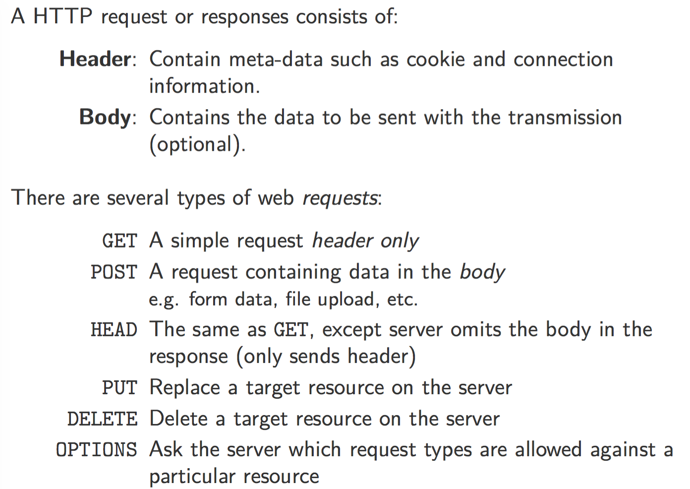
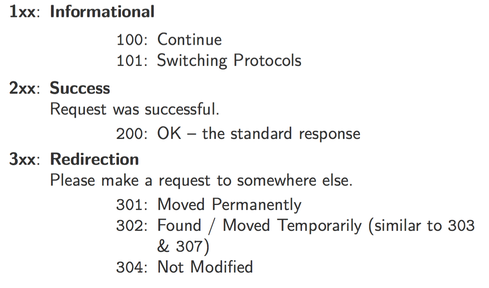
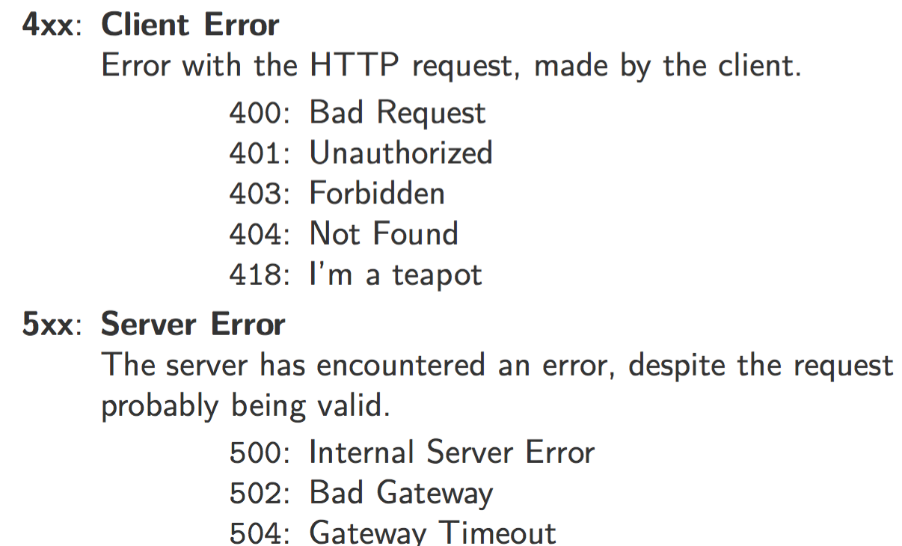
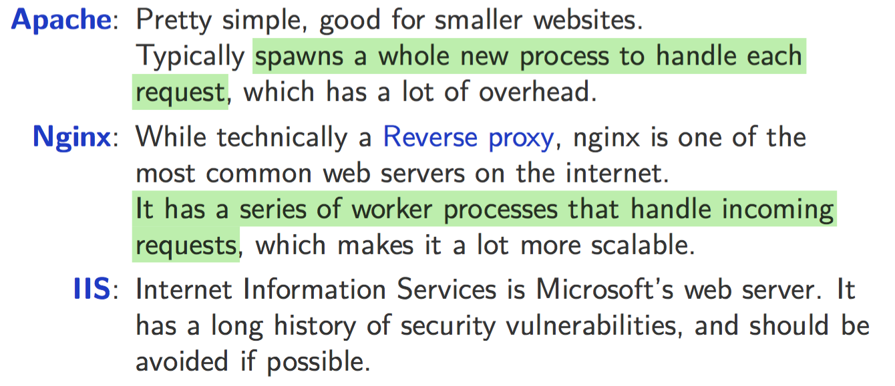
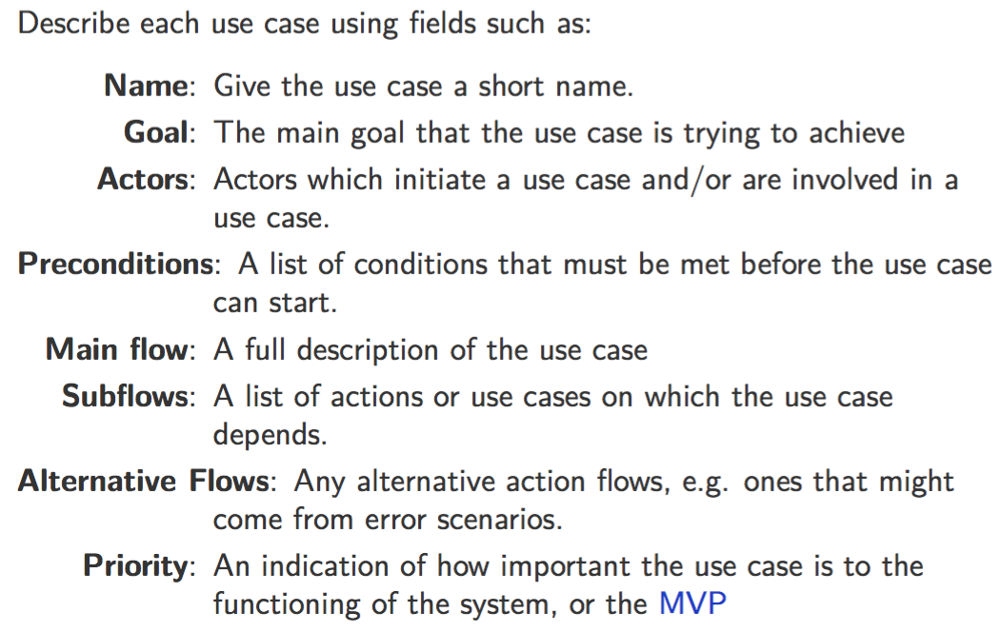
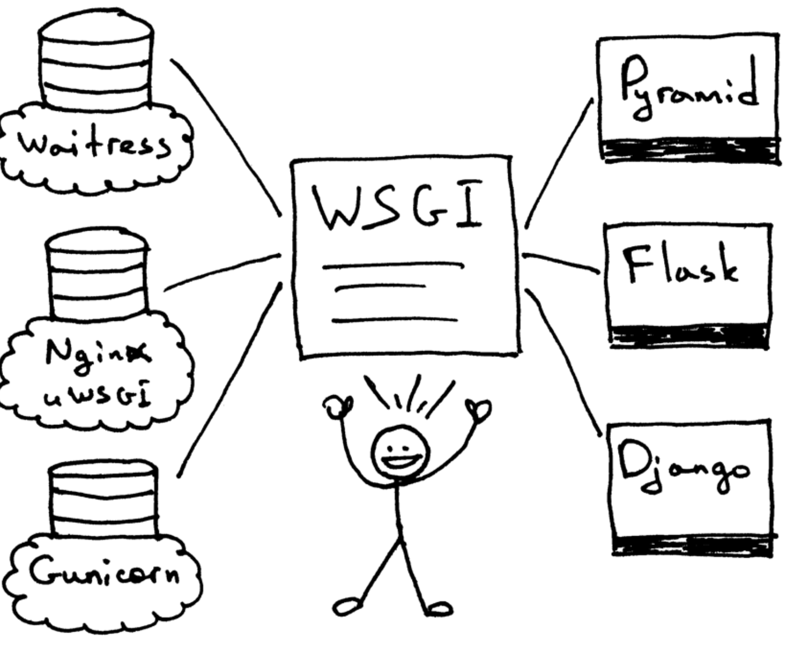
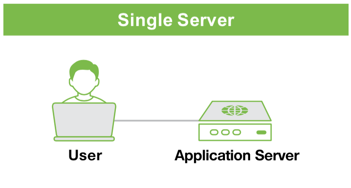
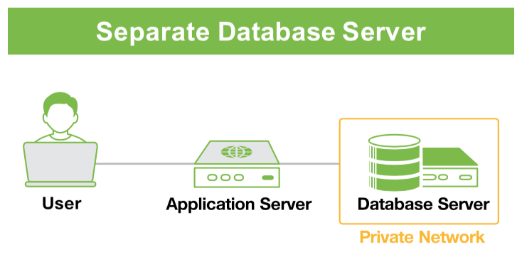
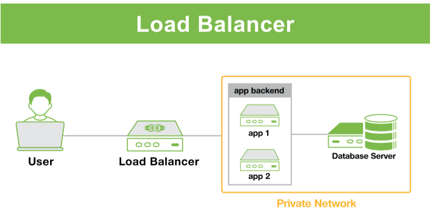
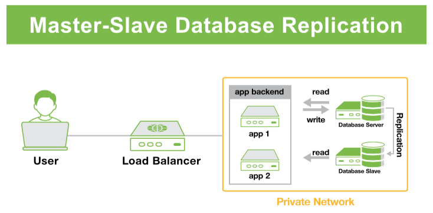

# **ELEC 3609 FINAL EXAM REVISON**

[TOC]


# **Web Fundamentals**:

**DHCP**: Dynamic Host Configuration Protocol;

**IP**: Internet Protocol;

**LB**: Load Balancer;

**DNS**: Domain Name Server;

**UDP**: User Datagram Protocol - port 53;

**TCP**: Transmission Control Protocol

**DDoS Mitigation Services**

**App Servers**: handles processing of HTTP requests **[** Backend website code + Business Logic + Database interface methods + Caching Layers.**]**

**Master <=> Slaves**: Write to master <=> Read from slaves [ Improving parallelizability of DB reads]

- **Issue**: **[**Slave drift: time delay between W & R, Race Condition**]**

**DOM**: Document Object Model

**HTML**: Hyper Text Markup Language

**CSS**: Cascading Style Sheets

**Browser Rendering**: done by web browser engines, e.g, WebKit of Safari

---

**OSI Model**: Operating System Interconnection Model;

- Physical: bits (0 / 1)
- Data link: bits => frames, Ethernet & LAN (Local Area Network)
- Network: IP & WAN (Wide Area Network)
- Transport: TCP & UDP
- Session: DNS
- Presentation: 
- Application: HTTP & FTP

----

##### **HTTP**(S): Hyper Transport (or Transfer) Protocol (Secure);

- Port: HTTP=80, HTTPS=443
- Request Components:




* Status Code:






----

##### **Web Server Software**

One of the most common stack: LAMP

* Linux + Apache + MySQL + PHP




# **Project Management**

**Process**:  Identify Problem <problem statement> 👉 Determine Use Cases <Action & Actors> 👉 Wireframes<UI & UX design> 👉  Software Requirement Specification<SRS> 

**What's in a Use Case Documentation**:



**Sequence Diagram**: 

* Useful for communicating how serveral systems interact.
* Shows how objects operate with another by time sequence. 

**State & Flow Diagram**:

* Useful for communicating how abstract concepts progress through the system
* Explain a state machine.

**SRS**: 

* Specifies the scope of the project <= checks when project is finished & prevents scope creep. 
* <u>Components</u>:
  * Introduction: business recognition; overall assessment of the project necessity
  * Overall Description: System structure (brief) + Dependencies + Constraints
  * Specific Requirements: Functional & Non-Functional requirements + other highly granular requirements. 

# **Web Servers and Application Architecture**


> [What is the difference between application server and web server????](http://stackoverflow.com/questions/936197/what-is-the-difference-between-application-server-and-web-server)

##### **Two Ubiquitous Stacks**

| LAMP       | LEMP      |
| ---------- | --------- |
| Linux      | Linux     |
| **Apache** | **Nginx** |
| MySQL      | MySQL     |
| PHP        | PHP       |

**ASP**: Active Server Pages

**<u>WSGI</u>**: [Web Server Gateway Interface](https://ruslanspivak.com/lsbaws-part2/).

* It was created as a ***<u>low-level interface between web servers and web applications</u>*** or frameworks to promote common ground for portable web application development..
* If an application (or framework or toolkit) is written to the WSGI spec then it will run on any server written to that spec 



**Relational Database**: enforcing and maintaining relationships, MySQL + PostgreSQL + SQLite

**Non-relational Database** (NoSQL): storing data like pages,  MongoDB (document based), Redis (K-V based), Cassandara (Column based) …. 

* Redis is useful for rapidly changing data with a foreseeable database size 
* MongoDB is good for dynamic queries / defining indexes. 

|           |          |
| ------------------------------------- | ---------------------------------------- |
| 👆 Web/App/Database Server all in ONE | 👆 Increase security; No contention  by App Server; But more complex and less independent on network connection |
|           | 👈  Useful for horizontal scaling; Imposing a single point of failure; LB can become the performance bottleneck; |
|      | 👈 Brings great performance Improvement on database system that performs <u>many reads compared to writes</u>; Additional attention to asynchronous issues |


# Backend Web Development

#### **Data modelling**:

**Keywords**: data modelling, normalisation, ERD(entity-relationship model)

**Process**: Identifying the detailed system requirements 👉 [Normalising](https://en.wikipedia.org/wiki/Database_normalization) the entities 👉 Writing the [data model](https://en.wikipedia.org/wiki/Data_model) 

**Model**: describes the fields which hold information about a particular entity. Typically, each model has a unique key known as the <u>primary key</u>. 

*  Relationships: One <=> One / One <=> Many / Many <=> Many

**MVC Design Pattern**:

* Model: manages the data
* View: renders data into views
* Controller: interprets requests and encapsulates business logic

**ORM**: [Object-relational mapping](https://en.wikipedia.org/wiki/Object-relational_mapping) is a programming technique for converting data between incompatible type systems in OO programming languages. Models become Classes, and each instance becomes an object, on which methods can be called. 

# Client-Server interoperation

## **Concepts:**

**XML**: Extensible Markup language, is a <u>markup language</u> defines a set of rules for encoding documents. 

**DTD**: Document Type Definition; is a set of markup declarations that define a document type for an SGML-family markup language (XML, HTML...).

```html
<!DOCTYPE HTML PUBLIC "-//W3C//DTD HTML4.01//EN" "..."> 
<!-- This is an (incomplete) example of telling the browser to use HTML4, and therefore HTML4 DTD is used to check html validity -->
```

**JSON**: JavaScript Object Notation is a language-independent data encoding structure. Useful for API communications and [Serialisation](https://en.wikipedia.org/wiki/Serialization) (converting object into byte string).

## **HTTP Anatomy**:

**MIME Types**: known as the 'media type'. Server uses it to convey client browser the type of transmitted resource, so that  the browser knows which default action to do to the resource. 

- <u>Syntax</u>: type/subtype  <= defined in '***Content-Type' header***
- <u>Common ones</u>: text/html, application/json, image/png

**Referer**: tell the server how a browser arrived at a particular page.

**User-Agent**: tells the server what type of software the client is using. 

* *Syntax*:  [ Browser, Rendering Engine, OS ]
* Why? the server knows which content to choose to respond. 

**Cookies**: a small piece of temp data stored in the user's browser. 

* Cookies can authenticate the user's browser to the server <= Gotcha! a potential security breach

## **Security**

**CSRF (Cross-site request forgery)**

* Happens when the *browser is authenticated* the and logged-in state maintains, then malicious website can embed code to *trigger sending unauthorised requests*. 
* **Mitigation**:
  * Embed a *<u>CSRF token</u>* in HTML resources, and the server verifies if the request is sent from trusted origin by checking the token. 
  * Set the token in cookies is not good enough, as the cookies might be stolen by XSS attack.

# **Frontend Development**

…  …  … 

**AJAX**: **A**synchronous **J**avaScript **A**nd **X**ML

* Allow the page to be updated with external data without a full refresh of the page  <= Send AJAX request to obtain the new data which is then used to update a subset of DOM. 
* jQuery is a lovely helper 😁

**Bower** - a package manager for the web <= similar to pip

**Grunt** - a Javascript task runner; does repetitive tasks such as bundle and build  <= similar to makefile

**Single Page Application**: HTML is loaded once and all updates are done via manipulation to DOM using Js !! 

* **Pros**: Smoother user experience (hardly feel the page is loading) & removes load from server & easy binding of data to the view - no need for a mess of jQuery & separation of concerns 

* **Cons**: harder to implement & may increase security risks & add burdens to browser & Slower initial page load & ***<u>SEO problem</u>*** (Google crawler only recognises the homepage and ignores the dynamically loaded components by Js)

  See this [post](http://adkgroup.com/insights/single-page-applications-spa-and-seo-problem) for why SEO problem is a major drawback 


# Continuous Integration And Deployment

## **Motivation**

* Having developers each working on individual module and wait for the final completion to start integration results in **INTEGRATION HELL**, a state where *<u>developers spend more time solving conflicts than writing the code itself</u>*

* To avoid suffering in the hell, we need **CI**, which is the practice of merging all developer working copies to a shared mainline *<u>several times a day</u>*. 

  > Fail fast, fail often

## **Conflicts**

##### **Types of Conflicts**

* **Merge conflict** == Developers have modified the same file concurrently
* **Logical conflict** == … such that the resulting system does not compile, i.e, 'You broke my code!!'
* **Functional conflict** == … such that the system does not execute successfully, i.e, 'Your code does not work with my code!!'

##### **Mitigations**

* Components should be independent as much as possible
* Use shared modules


## **Incremental Changes**

##### **Benefits**

1. ***Avoid 'stale branches'*** <= less chance of massive code rebasing
2. ***Small bugs are checked early***, and it's cheaper to rollback to a latest bug free state where only a small set of changes are lost.
3. Invisibly pushes developers to create ***modular, functional, quality and less complex code***

##### <u>How to be CI?</u>

* *Linting and Static Analysis*
* *Building*
* *Testing*
* *Publishing, Releasing and Deploying*

## **Anatomy of CI**

**Linting**: is the process of running a program that can analyse code for potential errors (likely to be bugs). <= IDE is able to integrate linter to support live checking. 

**Static Analysis**: kind of the debugging done by examining the code without executing the program. 


**Building (not just compling)**

* **Backend**: Optimising the autoloader + Pre-populating caches + Pre-redering templates + Vendoring dependencies
* **Frontend**: Bundling assets + Minifying images + Minifying codes + Transpiling Js (e.g, compile ES6 to ES5 for better browser compatibility) 

**Testing**

* **Unit testing**: focus on individual component/function; minimal dependencies
* **Integrate testing**: focus on whole code base; focus on (high level) APIs
* **Acceptance testing**: focus on the ability to meet requirements; examine completeness of functionalities
* **Regression testing**: ensure previous bugs do not come back to life. 

**Publishing**: produce end artifacts ready for deployment <= dependent on the tooling you use, e.g, gulp, angular-cli, grunt … 

## **Post-Deployment** (monitor what's happening on your app)

**Application Logging**: DEBUG/INFO/WARN/ERROR/FATAL; sourced directly from code results. 

**System-Level Logging**: monitors the server end behaviours (access/error...)

# Linux, Networking, and 'THE CLOUD'

## Linux

>  an *open source* <u>UNIX-like</u> operating system

**Linux Distribution**: is a collection of software that comes *pre-packaged* as a complete operating system.We all use distributions, not directly operating on the plain kernel … 

**User**: anyone who uses the system, is part of the access control

* **/etc/passwd**: text-based database of information about users that may log into the system, *each describing* username, group id, home dir, and startup executable… 
* **/etc/shadow**: stores sensitive password information (e.g, password hashes), only owned by superuser.
* **<u>*Program execute as a particular user !*</u>**

**Linux Image**: [a file that contains all the information needed to produce a copy](http://unix.stackexchange.com/questions/208407/why-is-the-linux-kernel-called-an-image)

**Package Managers**: for instance, <u>***Advanced Packaging Tool***</u> (APT). But we usually cannot use it if we want to keep up-to-date with the latest changes asap, or more customisable installation options/

## Secure Shell (SSH)


**SSH Server**: A piece of software listening to TCP <u>*PORT 22*</u> and authenticating connecting users by password/(public or private) keys

**SSH Client**: Client side software manages the communication with the server. 

**SSH Keys**: 


* Each server has a identifier known as the ***fingerprint*** to keep track of server's public key; client needs to add it to known_hosts to accept connection. Very important to mitigate [**<u>*MITM attack*</u>**](https://en.wikipedia.org/wiki/Man-in-the-middle_attack)

**SSH Agent**: 

> a running program to store the unencrypted SSH private key <u>***in memory***</u> so lazy people don't need to type password every time. 

## Amazon AWS (amazon web services)

**EC2**: Elastic Compute Cloud provides access to *server '**instances**'*.

**EBS**: Elastic Block Store provides ***hard drives*** or 'volumes'* that can be *attached* to EC2 instances <= a good choice to have a separate place *for data storage* (so data loss even if instances fail)

**VPC**: Virtual Private Cloud enables greater ***control and network segregation*** for your EC2 instances. 

**AZ**: Availability Zones


## Ports & Security

**Privileged ports**: those below 1024 require root access to start listening <= it's a design as *security feature*, in that if you connect to a service on one of these ports you can be sure the other side is the real thing. 

**(AWS) Security Groups**: are set of *firewall rules* (protocol, port and source specifications) that can be applied to EC2 instances. 

**(AWS) Elastic Load Balancer (ELB)**: provides a load balancing service for you instances <= good helper to scale horizontally

* auto distribute incoming traffic  amongst multiple instances 
* audo redirect traffic to working instance if the target is failing … 

**Elastic IPs**: a *<u>consistent</u>* IP address on your EC2 host


# Cloud Services

**"Cloud"**: the collection of software services, hardware, network, storage …. 

**Cloud Types**:

* **IaaS**: Infrastructure as Service (hosting)
* **PaaS**: Platform as Service (building). Eg, AWS Relational Database Service. 
* **SaaS**: Software as Service (consuming). Everything above are combined in this. 

TO BE CONTINUED … (If I have time 😁)


# Web Security

## **It's about HACKING and ANTI-HACKING!**

**Axiom of Information Security （snippet）**:

* All systems are buggy <= folks always find ways to hack your system
* Nothing works in isolation <= isolate your system well!
* Humans are most often the weakest link <= don't do stupid things and follow the best practice!

**What is a 'System'?** Anything from a product/component to infrastructure, applications or users… <= each has its security weaknesses! 

[**OWASP**](https://www.owasp.org/index.php/About_OWASP): these guys are there to educate you why systems are hacked and how to prevent it from happening. 

## Vulnerabilities, Vulnerabilities everywhere! 

| ATTACK          | WHY & WHAT                               | mitigation                          |
| --------------- | ---------------------------------------- | ----------------------------------- |
| SQL Injection   | 🔹Failing to sanitise user input before inserting it into DB string; 🔸Triggers malicious SQL query running on server | SanitisationParameteized queries    |
| XSS             | 🔹Failing to sanitise +1 🔸 Triggers malicious code to run on user browser; Reason of Cookie leaks | Transpile HTML syntax in user input |
| CSRF            | 🔹Failing to verify the source of request 🔸Fools user browser to send unauthorised requests with auth cookies (on when user stays authenticated) | Check CSRF token per request        |
| File Inclusion  | 🔹Allowing users to govern what files can be included 🔸Fools the server to respond with server files. | TODO                                |
| Remote Code Exe | The worst type of exploit! The injected code can do anything on server | TODO                                |

## **Password Protection**

**Hashing** is a a common way to <u>*not storing plain text password*</u>s on server to minimise the danger of  password database leakage. 

* **Hash Function**: One way + Unpredictable + Non-collision
* **Salting**: instead of  H(password), use H(<u>***salt***</u> || password). This makes *pre-computed dictionary (like [Rainbow table](https://www.zhihu.com/question/19790488)) attack* harder as each encrypted password is a result of deviated hashing, so the same dict does not apply for all. 

**Authentication Cookies** is a means for post-loggingin authentication. 

* **Statefully**: Valid token is stored in server <= a burden on database; more DB hits; hard to modify auth rules. 
* **Statelessly**: Client still stores the token, but the server validates by re-calculating the token using *hash(secret || validity_ts || user_id)*. Only the server can calculate the token as the secret info is stored at server side <= <u>trade space for time</u>. 

**Managing Cookies**: HTTPS (no HTTP) + [SecureFlag attribute](https://www.owasp.org/index.php/SecureFlag) + [HttpOnly attribute](https://www.owasp.org/index.php/HttpOnly)

# Pre-Packaged Software

> **Packages** typically consists of: Application Code, Configuration Files* and tDatabase*

## Choose the package

<u>*Evaluate*</u> and understand other people's software before making your mind to use it. 

* ***Identify other users***: do other giants like it?
* ***Identify potential support avenues***: how active is community? how responsive is the dev team? 
* ***Check for the frequency of commits***: Is development active?
* ***Scan for vulnerabilities***: the code is also public to attackers :D.

## Configure the package

Figure out what are the configuration <u>*options*</u> prior to deployment

* ***Look through all config options***: don't miss out features;
* ***Search the internet for example configs***: what did other do and find about the config?
* ***Identify all features***
* ***Disable unwanted feature***: to reduce complexity and surface for possible attack

## Setup the Database

Checkpoints are:

* ***Identify database requirements***
* ***Identify database permission***: app should be given minimum set of permissions to run <= AVOID GRANTING ROOT ACCESS!
* ***Evaluate the scope of DB compromise***: DB commands that can run system commands should be locked down if possible
* ***Keep the connections local***: just the app running on local machine should manage the DB.

## Deploy the Pre-packaged Software

**Use RP** (reverse proxy) for the sake of ***scaling***, ***request auth*** (e.g, access to internal services should be blocked) and ***web app firewalls*** (requests are assessed before accepted; *<u>NAXSI</u>* is an good one 😀)

## **Docker** - Build, Ship, Run … 

> Docker is an open-source project to automate the deployment of
> applications inside <u>linux containers</u>

**What is the Linux Container in Docker?** instead of running many virtual OS, containers can be used as a lightweight solution for the need of isolated environments. 

* You can think of a docker container as it's own ***minimalistic Linux hos**t* based off a ***docker image***
* Similar to 'Volumes' as to 'Instances' in AWS, data storage segregation can be achieved by ***mounting volumes*** onto docker containers. 
* Containers can be ***linked*** and have certain *ports* forwarded (similar to how instances are linked in same AWS AZ?)
* ***Docker Hub*** is the pool of pre-built images 👏

## Monitoring - How are we going today 😳?

**Infrastructure Monitoring**: for instances, Network traffic, Server performance… [ Nagios, Graphite ]

**Error Monitoring**: collects errors from website and consolidates them [Sentry]

**User Monitoring**: collects user information; inference user behaviours … [G. Analytics, Kissmetrices]

**Custom Tracking**: Make own monitoring system to better suit your system. 